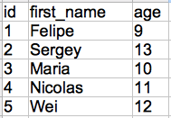

# Discussion
A *database* is made of groups of information called *tables*.  You can think of a table like a spreadsheet — it has a series of rows and columns.  Each table has a name, too.  We’ve created a sample table called “people”, that looks like this:

Often, we’ll use a column called “id” (which means “identifier”) to assign a number to each row.  This makes asking questions about the information easier.

# Question
What’s the name of the person with an id of {{1,2,3,4,5}}?

# Answer
{{'Felipe','Sergey','Maria','Nicolas','Wei'}}

# Explanation
Find the name by looking at the row starting with {{1,2,3,4,5}}.
